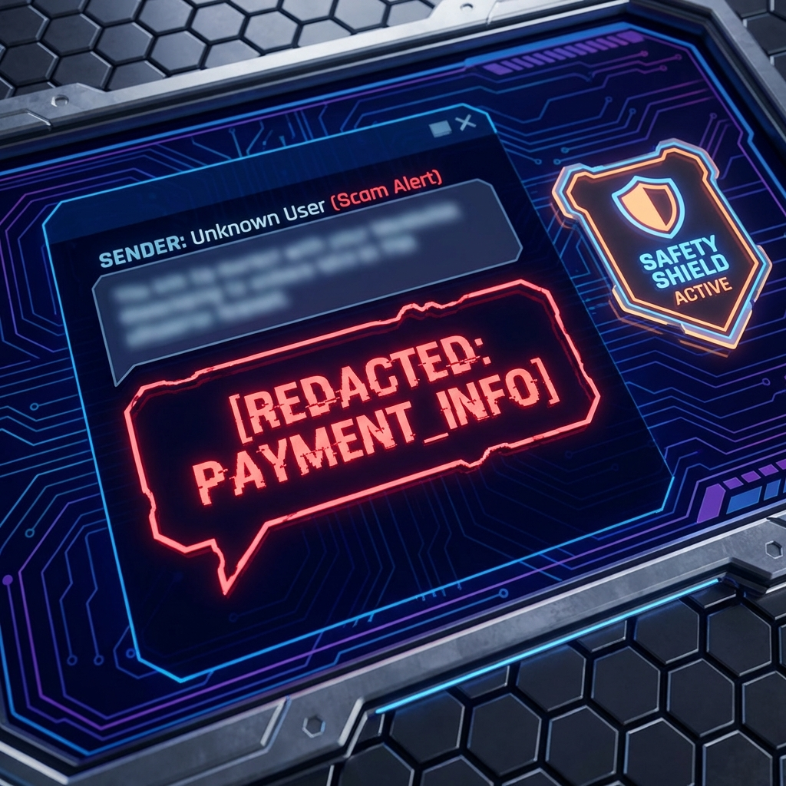

# Presentation Deck: Honeypot AI Defense System

---

## Slide 1: Title Slide
**Title:** Honeypot AI Defense System
**Subtitle:** Autonomous Counter-Offensive Against Digital Fraud
**Presenter:** [Your Name/Team Name]

---

## Slide 2: The Problem
**Visual:** Graph showing rising cybercrime statistics or a collage of "Your account is compromised" scam messages.

*   **Scams are Industrialized:** Fraudsters use automated bots and scripts to attack millions effectively.
*   **Manual Defense is Slow:** Victims often panic; law enforcement can't track real-time ephemeral chats.
*   **The Cost:** Billions lost annually to financial fraud (Crypto, UPI, Wire Transfer).

**Speaker Notes:**
"We are facing an asymmetry. Scammers use automation to attack at scale, while defense is reactive and manual. We need a system that fights back at the same speed."

---

## Slide 3: Our Solution - Active Defense
**Visual:** Icon of a Shield reflecting an arrow back at the attacker.

*   **Autonomous AI Agents:** Intelligent bots that intercept and engage scammers automatically.
*   **Time Wasting Protocol:** The goal isn't just to block, but to *engage*. Every minute a scammer spends talking to our AI is a minute they aren't attacking a real victim.
*   **Intelligence Gathering:** Passive collection of location, device info, and financial identifiers.

**Speaker Notes:**
"We built an 'Active Defense' system. Instead of blocking the call, we answer it. We waste their time, frustrate their operations, and silently extract intelligence."

---

## Slide 4: Key Feature - Infinite Conversation Loop
**Visual:** Screenshot of the Chat UI showing a long conversation.

*   **Adaptive Personas:** The AI switches roles (e.g., *Confused Grandpa*, *Greedy Investor*, *Skeptical IT Pro*).
*   **Infinite Depth:** If the scammer tries to leave, the AI baits them back. "Wait, I found the credit card!"
*   **Result:** Conversations can run indefinitely, draining scammer resources.

**Speaker Notes:**
"Our AI doesn't just say hello. It adapts. If the scammer gets impatient, it plays the victim. If they get greedy, it plays the whale. We've proven it can keep a scammer hooked for hours."

---

## Slide 5: Key Feature - Financial Intelligence Tracing
**Visual:** Screenshot of the "Live Intercept" panel showing a red "FINANCIAL ID" card.

*   **Real-Time Decryption:** Analyzes chat patterns to extract hidden banking details.
*   **Region Aware:**
    *   **India:** Detects UPI IDs (e.g., `merchant@okhdfcbank`).
    *   **Europe:** specific IBAN formats.
    *   **Global:** Crypto Wallet addresses (BTC/ETH).
*   **Actionable Data:** Exports data for law enforcement freezing.

**Speaker Notes:**
"This is our most powerful feature. As the scammer sends payment instructions, we intercept them. We identify the mule accounts in real-time, allowing for immediate reporting."

---

## Slide 6: Key Feature - "War Room" Simulation
**Visual:** Screenshot of the Dashboard in "Red Alert" mode with 50+ active threads.

*   **Botnet Simulation:** Simulates a massive coordinated attack (50+ concurrent threads).
*   **Stress Testing:** Proves the system can handle industrial-scale fraud campaigns.
*   **Visualization:** Global Threat Map shows attack vectors in real-time.

**Speaker Notes:**
"We don't just handle one call. We can handle a flood. Our 'War Room' mode demonstrates the system's ability to juggle 50 simultaneous conversations without breaking a sweat."

---

## Slide 7: Technical Architecture
**Visual:** Diagram: [Scammer] -> [Honeypot API] -> [AI Agent Node] -> [Analysis Engine] -> [Evidence DB].

*   **Frontend:** React + TypeScript (High-performance Dashboard).
*   **Intelligence:** Heuristic Intent Analysis (No external AI API dependency for core loop).
*   **Security:** Air-gapped "Evidence Locker" for data integrity.

---

## Slide 8: Impact & Future
**Visual:** Summary metrics (Time Wasted, Wallets Flagged).

*   **Disruption:** significantly increases the *cost* of doing business for scammers.
*   **Protection:** Shields vulnerable users by absorbing the traffic.
*   **Future:** Integration with Telco grids to intercept calls at the network level.

**Speaker Notes:**
"By reversing the economics of scams, we make it unprofitable to attack our users. That is the ultimate defense."

---

## Slide 9: Advanced Capabilities
**Visual:** Split screen showing a redacted chat log and a generated PDF report with a barcode.

*   **Audio Immersion:**
    *   **Realistic Soundscapes:** Simulates typing sounds, incoming call alerts, and success chimes to create a believable environment for the user (and the scammer, if voice were integrated).
*   **Forensic Evidence Generation:**
    *   **Chain of Custody:** auto-generates PDF reports with cryptographic hashes and barcodes.
    *   **JSON Export:** Analysis data is chemically structured for ingestion by cybersecurity tools.
*   **Safety Protocols:**
    *   **PII Redaction:** Real-time scrubbing of credit card numbers, SSNs, and emails prevents accidental data leakage during the simulation.
    *   **Policy Checks:** Ensures the bot remains within legal and ethical boundaries.

---

---
